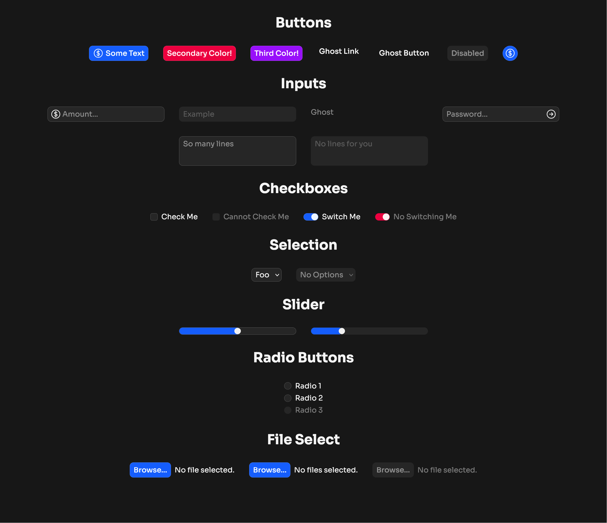

# Mock UI

This repository is a starting template for Svelte and Tailwind frontends. It provides fundamental features that I consider any website using this stack should have:

## What's Included

- [Basic Form Components](#form-components)
    - All components follow [a well-defined visual design language](#visual-design-language)
    - Are compatiable with HTML `<form>` tags
    - [Are easily extensible via props](#component-props)
    - Use little to no JavaScript—try to stay as vanilla HTML as possible for both accessibility reasons and browser support reasons
- [Tailwind Base Setup](#good-tailwind-defaults)
    - [Colors are set up in a structured and coherant way](#colors), following Material Design's color roles system
        - [Theming](#theming) is implemented with light/dark mode in mind, making it very easy to do after customizing your themes
    - Custom utilities and variants are provided by default that make design consistency easier

In previous interations of this repository, Mock UI was considered to be more of a starting point for **form components exclusively**. Since then, I've realized its true purpose can be far more broad.

## Form Components



### Visual Design Language

I tried keeping a consistent design language across all components, primarily ones that are interactable (form components).

1. All Components
    - Light border (white with 25% opacity), which allows it to play off the backgroud color and is therefore widely applicable
        - The border becomes lighter (50% opacity) when the user is only _one step away_ from using a component
    - Compact in size, allowing for easier scaling
2. Disabled Components
    - Borders disappear, which let's them blend into the background
        - Their color is set to `transparent` so they don't shrink in size
    - Cursor is `not-allowed`
    - Text color should be 50% less opaque

### Example 1 / `MockButton`

In some component's cases, they accept children in place of the `label` attribute.

```html
<!-- This is valid -->
<MockButton>Label</MockButton>

<!-- But I prefer this way unless you need HTML -->
<MockButton label="Label" />
```

If you need to pass in some fancily styled elements it's worth noting that all components that render children have the `group/<component>` Tailwind class on them. In `MockButton`'s case, it is `group/button`.

### Example 2 / `MockInput`

`MockInput` allows you to pass snippets to render buttons or icons on the left or right side of the input field.

```svelte
{#snippet right()}
    <Icon
        class="size-6"
        data={faX}
    />
{/snippet}

<MockInput {right} />
```

### Example 3 / Recoloring Components

All components primarily make use of `var(--color-component)` for their coloring. Through the power of Tailwind, it's now very easy to change the color of a component or a group of components.

```svelte
<!-- this makes the button turn red -->
<MockButton
    class="component-red-500"
    label="Hello world"
/>
```

The format is `component-<color>/<text-color>` where `<color>` is any Tailwind color. This also trickles down to child elements, so you can easily change the color of a group of components.

```svelte
<!-- makes both buttons red -->
<div class="component-red-500/red-50">
    <MockButton label="Hello world" />
    <MockButton label="Hey world" />
</div>

<!-- remains the default primary color -->
<MockButton label="Hi world" />
```

#### Component Text Color

This Tailwind utility allows for a text color modifier to be specified, if applicable. Providing a text color re-defines the `--color-on-component` to the color specified.

If unspecified, tries to find a corresponding `on-` color. This means that doing `component-secondary` will automatically do this for you because `--color-on-secondary` is defined already. Writing `component-secondary/on-secondary` is redundant.

### More Examples

For more code examples take a look at [the default +page.svelte](src/routes/+page.svelte).

### Component Props

All unknown props passed to a component are passed to the target component element. Which means, aside from wrapper elements, you aren't missing access to any attributes on mock components.

### The `class` Attribute

All classes passed into `class` on all components are merged with `tailwind-merge` on the primary visual element of the component.

## Accessibility

All components are designed to be keyboard accessible, by keeping them as simple and as close to their original counterparts as possible. All components work with plain `<form>` tags.

## Good Tailwind Defaults

This repository contains a default Tailwind config that I think is best for general purpose website development. The focus behind these utilities is to provide a means for creating consistent UI.

### Colors

The colors specified by default are meant to be for easy theming, and follow a similar pattern to Material Design. This means colors are categorized into roles:

```css
--color-primary: var(--color-blue-500);
--color-on-primary: var(--color-blue-50);
```

The focus is separating between background colors and text colors, where text colors compatiable with certain backgrounds begin with an `on-` prefix.

Read more about [Material Theme's color roles](https://m3.material.io/styles/color/roles#19e75989-7485-4f5b-a769-940c4e4364bc) to learn more.

### Pre-defined Spacing

For consistent spacing in paddings, margins, gaps, etc. pre-defined spacing have been defined. It follows a similar pattern to some other utilities: `xs`, `sm`, `md`, `lg`, `xl`, etc.

These utilities follow an expontential growth for the 5 mentioned above, but upon reaching `2xl`, `3xl`, `4xl`, will instead increase by `--spacing(16)` each time. This is because past a certain point it begins to get ridiulously large and impractical. Making the increments cap at `--spacing(16)` means it's far easier to find an in between when needed.

### Theming

All colors are defined at once in a theme definition utility (`theme-<name>`). This means that for sites that should want to implement light/dark mode or custom theming for their users, doing so should be as simple as overriding the variables defined.

To see what a theme definition looks like, [take a look at the default `theme-neutral`](https://github.com/josssch/mock-ui/blob/9e19ce401c66a16446fff1e55ff179afa738901e/src/default.css#L64-L81).

The [default theme should always be applied on the `:root` selector](https://github.com/josssch/mock-ui/blob/9e19ce401c66a16446fff1e55ff179afa738901e/src/default.css#L93-L96). This ensures all theme variables are properly defined and should any overrides take place with missing colors, that there are fallbacks.

Any further themes should be controlled at the `body` level or nested level by using the defined `theme-<name>` utility class. **It must be an `@utility` if full Tailwind functionality is desired.**

## Todo

Things I'd like to accomplish in this repository in order for me to consider it complete.

- [ ] Default light/dark mode themes and Tailwind setup
- [ ] SEO tags setup, since implementing this in Svelte is still awkward
- [ ] A good way to generate color pallettes and reduce repetition
    - In Tailwind colors are defined with different brightness levels, being `50`, `100, 200, ..., 900`, and `950`. These are very helpful, but in most cases doing this for each color can be very tedious. For colors in the theme (primary, secondary, container), there should be dim/bright/brighter variants without the need to define them.
- [ ] Make inner `MockButton` in `MockFileSelect` not require an onclick handler, likely the solution will be replacing the button with a different element
- [ ] Fix default appearance for `MockSelect` in Safari to not be glossy
- [ ] `shadcn/ui`-like CLI for installing components
- [ ] For components where they are comprised of several HTML elements, it's not immediately clear where the rest of the `$props()` go. Furthermore, it's _annoying_ you have to even choose where they go, **a prop grouping API** where other elements can be specified with a prefix (e.g. `<el>-<prop>`, `label-class="max-w-36"` makes `class` apply to `label`, `svg-class="size-24"` applies `class` to a given `svg`, etc.)
