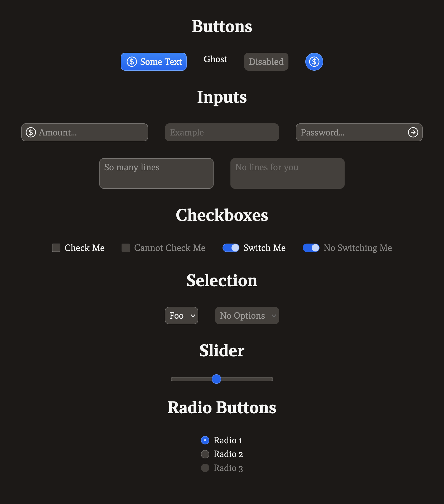

# Mock UI

Very simple component library made in [Svelte v5](https://svelte-5-preview.vercel.app/docs/introduction) and [Tailwind v4](https://tailwindcss.com/blog/tailwindcss-v4-alpha). The point of this for me was to test out what each update is bringing to the table. I also intend on using these components to do quick mockup UIs and projects, hence the name.



## Visual Design Language

I tried keeping a consistent design language across all components, primarily ones that are interactable (form components).

1. All Components
    - Light border (white with 25% opacity), which allows it to play off the backgroud color and is therefore widely applicable
        - The border becomes lighter (50% opacity) when the user is only _one step away_ from using a component
    - Compact in size, allowing for easier scaling
2. Disabled Components
    - Borders disappear, which let's them blend into the background
        - Their color is set to `transparent` so they don't shrink in size
    - Cursor is `not-allowed`
    - Text color should be 50% less opaque

## API Design

I have tried to make it so components make use of Svelte v5's new feature, [Snippets](https://svelte-5-preview.vercel.app/docs/snippets), wherever they can. These effectively allow for passing Svelte code as arguments, but I avoided that where I could.

### Example 1 / `MockButton`

In some component's cases, they accept children in place of the `label` attribute.

```html
<!-- This is valid -->
<MockButton>Label</MockButton>

<!-- But I prefer this way unless you need HTML -->
<MockButton label="Label" />
```

If you need to pass in some fancily styled elements it's worth noting that all components that render children have the `group/<component>` Tailwind class on them. In `MockButton`'s case, it is `group/button`.

### Example 2 / `MockInput`

`MockInput` allows you to pass snippets to render buttons or icons on the left or right side of the input field.

```svelte
{#snippet right()}
    <Icon
        class="size-6"
        data={faX}
    />
{/snippet}

<MockInput {right} />
```

### Component Props

All unknown props passed to a component are passed to the target component element. Which means, aside from wrapper elements, you aren't missing access to any attributes on mock components.

### The `class` Attribute

All classes passed into `class` on all components are merged with `tailwind-merge` on the primary visual element of the component.

## Accessibility

All components are designed to be keyboard accessible, by keeping them as simple and as close to their original counterparts as possible. All components work with plain `<form>` tags.

## Final Notes

-   I have not set this up to be used as a library, but more as a boilerplate repository
-   The current set of components currently are focused around being form compatible
